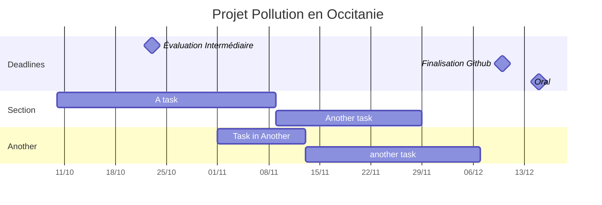

# Pollution en Occitanie

Le but de ce projet en groupe est de créer un site internet présentant une étude de la pollution de l'air en Occitanie à partir de données tirées de ATMO Occitanie et SYNOP data.

## Descriptif
Dans un premier temps, la page internet comportera une carte de la region, à partir de laquelle on pourra observer la pollution de l'air dans différentes villes. Selectionner une ville nous permettra d'avoir accès à des représentations graphiques parametrables en fonction des polluants et des échelles de temps.

## Modules nécessaires
Nous utiliserons pour ce projet des modules Python de calculs et de représentations graphiques tels numpy, mathplotlib, pandas, de gestion de données tel pooch ou db et de création de carte tel Folium.

## Répartition du travail

'lien_vers_le_site_web'
'extraits_de_code'
Auteurs: DIALLO, LAPI, MANNEQUIN, MOTTIER