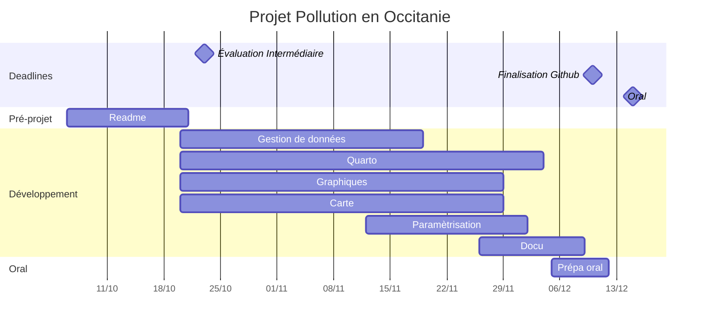

# Pollution en Occitanie

Le but de ce projet en groupe est de créer un site internet présentant une étude de la pollution de l'air en Occitanie à partir de données tirées de ATMO Occitanie et SYNOP data.

## Descriptif
Dans un premier temps, la page internet comportera une carte de la region, à partir de laquelle on pourra observer la pollution de l'air dans différentes villes. Selectionner une ville nous permettra d'avoir accès à des représentations graphiques parametrables en fonction des polluants et des échelles de temps.

# Packages
Pour un projet sur la pollution de l'air en Occitanie, voici quelques-uns des packages Python les plus importants que nous devrions utiliser :

1.	NumPy et Pandas : Ils sont essentiels pour la manipulation des données, le nettoyage, la transformation et l'analyse.

2.	Matplotlib et Seaborn : Ces bibliothèques sont cruciales pour la création de graphiques et de visualisations de données.

3.	Requests : Utile pour effectuer des requêtes HTTP et récupérer des données depuis des sources en ligne, telles que les données de qualité de l'air fournies par les agences gouvernementales.

4.	Scikit-Learn : Si nous prévoyons de réaliser des analyses plus avancées, comme la modélisation de la qualité de l'air.

5.	Plotly : Permet de créer des graphiques interactifs pour visualiser les données.

6.	Streamlit : pour créer une application web interactive pour visualiser et analyser les données de la pollution de l'air.

Ces packages couvrent les aspects essentiels de la collecte, de l'analyse et de la visualisation des données de qualité de l'air. Nous pourrions ainsi effectuer une analyse approfondie et présenter nos résultats de manière efficace.

## Choix des données
Pour mener à bien ce projet, nous aurons besoin de données que nous allons télécharger (au format .csv) directement sur le site ATMO Occitanie pour ce qui concerne la pollution. Ici, seules les données concernant la cencentration de certains polluants athmosphériques (NO2, PM, O3, NOx, NO, SO2) dans les zones urbaines de la région Occitanie nous serons utiles.
Toutefois, étant donnée que la metéo peut elle aussi avoir une influence sur la qualité de l'air, nous utiliserons également les données de SYNOP pour compléter nos analyses.

## Modules nécessaires
Nous utiliserons pour ce projet des modules Python de calculs et de représentations graphiques tels numpy, mathplotlib, pandas, de gestion de données tel pooch ou db et de création de carte tel Folium.

## Répartition du travail

Quatre branches principales de développement ont été identifiées :

+Extraction et tri des données - gestion du téléchargement des données par l'utilisateur - package pooch (LAPI)
+Construction des graphiques en fonction des lieux, des polluants (DIALLO)
+Construction de la carte et intégration de données de pollution (MANNEQUIN)
+Écriture du fichier quarto, insertion des différents éléments Python, mise en place de l'intéractivité (MOTTIER)

'lien_vers_le_site_web'
'extraits_de_code'

Auteurs: DIALLO, LAPI, MANNEQUIN, MOTTIER